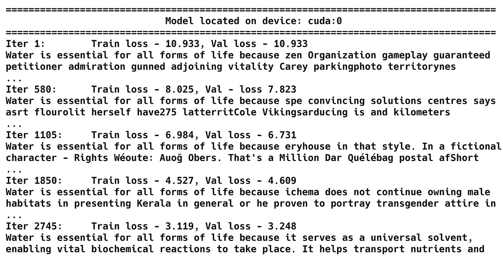

# GPT-Style Language Model from Scratch



</div>
 This project trains a GPT-2-level large language model (LLM) from scratch, allowing you to explore how modern LLMs are built and trained. By experimenting with smaller or larger models, as well as small (public-domain text) or large (English Wikipedia) datasets, you can better understand the inner workings and trade-offs involved in training such models.

## Key Features

- **Modular training scripts:**  
  - `train_gpt_txt.py`: Trains on a small text dataset (e.g., "Alice in Wonderland"), suitable for quick local experiments.
  - `train_gpt_wiki.py`: Trains on a large English Wikipedia dataset (~11 GB, ~6.4M articles), requiring a Hugging Face account and API token.

- **Parameter Tuning:**  
  Easily adjust training parameters (batch size, context length, subset ratios, advanced training techniques) directly in the scripts.

- **Model Configurations:**  
  Two sample configurations (162M and 400M parameters) are provided. These configurations mimic GPT-2 scale models and can be adapted depending on your compute resources.

- **Device Flexibility:**  
  The code can detect and run on the best available device (`cpu`, `mps`, `cuda`) for efficient training.

## Setup Instructions

1. **Install Miniconda (Recommended):**  
   [Miniconda Installation Guide](https://docs.conda.io/en/latest/miniconda.html)

2. **Create and Activate the Environment:**
   ```
   conda create -n my_LLM python=3.10.15
   conda activate my_LLM
   pip install -r requirements.txt
   ```

3.	**Hugging Face Login (For Wikipedia Data):**
    ```
    huggingface-cli login
    ```
    You need a Hugging Face account and API token to access large datasets.

## Running the Training

- **Small Dataset (e.g., “Alice in Wonderland”):**

    Ideal for quick local tests and understanding the training loop:

    ```
    python train_gpt_txt.py
    ```

- **Large Dataset (English Wikipedia):**

    For more realistic large-scale training (GPU recommended):
    ```
    python train_gpt_wiki.py
    ```

## Important Parameters

Modify the yaml files as needed: Below are the yaml settings for 162M as an example

```
# Model settings
model:
  output_dir: outputs
  save_name: gpt-model-text-2.pt
  device: null  # cpu, mps or cuda. If None, will select the best available one
  model_type: GPT_CONFIG_162M  

# Training configuration
training:
  test_train_ratio: 0.9  # Test vs Train split ratio
  num_epochs: 20  # Number of epochs (1, since the dataset is already huge)
  batch_size: 16  # Suggested 8 or less for local training, 16/32/64/128 for GPU
  subset_ratio: 0.001  # Percentage of original dataset to use (e.g., 0.1 = 10%)
  advanced_training: false  # Enables learning rate warmup, cosine decay and gradient clipping
  test_before_training: false  # If true, tests model before training (may take time)

# Inference settings
inference:
  start_context: "Water is essential for all forms of life because "
  temperature: 1.2

# Model Architecture Configurations
model_configs: # 162M parameter configuration
  vocab_size: 50257   # Vocabulary size
  context_length: 256 # Shortened context length (orig: 1024)
  emb_dim: 768       # Embedding dimension
  n_heads: 12        # Number of attention heads
  n_layers: 12       # Number of layers
  drop_rate: 0.01     # Dropout rate
  qkv_bias: true    # Query-key-value bias

```


## Additional Scripts
- **Use a Trained Model:**
    ```
    python run_model.py
    ```
    Make sure you specify the correct model path and name in run_model.py.

- **GPU vs CPU Testing (If GPU available):**
    ```
    python gpu_debug_test.py
    ```

## Results and Performance (124M model, CPU and MPS on Macbook Pro M2, 32GB RAM; GPU on single A100)
### “Alice in Wonderland” Training:

- CPU: ~3.96 min
- MPS (Apple Silicon): ~1.68 min
- GPU: ~0.27 min (batch=8), ~0.22 min (batch=32)

### English Wikipedia Training (0.01% subset):

- CPU: ~6.94 min
- MPS: ~2.41 min
- GPU: ~0.46 min (batch=8), ~0.4 min (batch=32)

These results show clear performance gains when using GPU acceleration and larger batch sizes. Even a small fraction of the Wikipedia dataset produces coherent text. Using the 124M model on a fraction of Wikipedia (1% of data, ~30 million tokens) for ~37 minutes on a GPU yields significantly more logical and coherent text than training solely on a small dataset.

## Tips
- **Smaller Model + More Data:** Often produces more coherent results than a larger model trained on very limited data.
- **Advanced Training Techniques:** Try enabling `ADVANCED_TRAINING` for learning rate warmup, cosine decay, and gradient clipping to improve stability and results.
- **Experimentation is Key:** Adjust batch sizes, subsets of data, and training time to see what fits your compute resources and desired outcome.

## Further Reading
For additional insights and inspiration, check out the [LLMs-from-scratch GitHub repository](https://github.com/rasbt/LLMs-from-scratch).